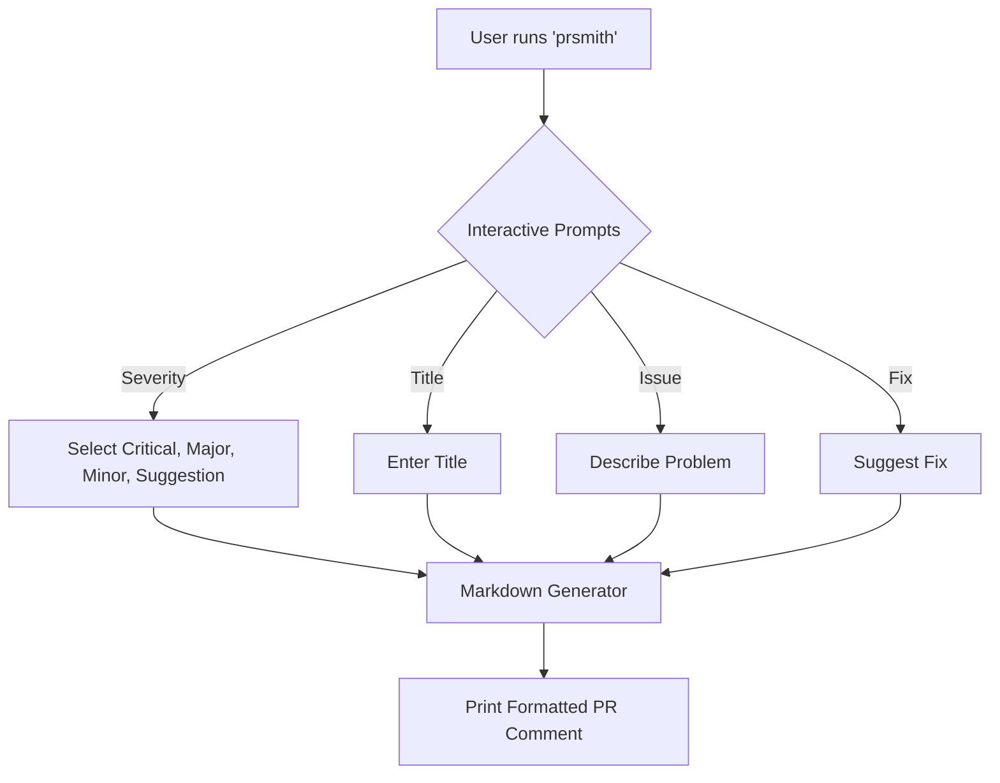

# PRSmith

[](https://www.npmjs.com/package/prsmith)
[](https://opensource.org/licenses/MIT)
[](https://github.com/TarunyaProgrammer/PRSmith_NPMPackage/actions)

Forge professional pull request review comments directly from the terminal.

PRSmith streamlines the process of writing code reviews by providing an interactive prompt that generates consistently formatted, polite, and actionable Markdown comments.

---

## Architecture Flow

The tool operates via a straightforward interactive flow, generating structured markdown from your inputs.



---

## Installation

Install globally to use it anywhere on your machine.

```bash
npm install -g prsmith
```

## Usage

Simply run the command in your terminal:

```bash
prsmith
```

## Example Interaction

**Input:**

- Severity: `Critical`
- Title: `Scope Issue`
- Issue: `Utility functions are nested incorrectly.`
- Suggested Fix: `Move them to module scope.`

**Output:**

### Critical: Scope Issue

The current implementation introduces a critical issue.

**Problem**

Utility functions are nested incorrectly.

**Suggested Fix**

Move them to module scope.

## Development & Contribution

To set up the project locally:

```bash
# Install dependencies
npm install

# Run the CLI locally
npm start

# Run unit tests
npm test

# Lint the codebase
npm run lint

# Format the code
npm run format
```

## License

This project is licensed under the MIT License.
